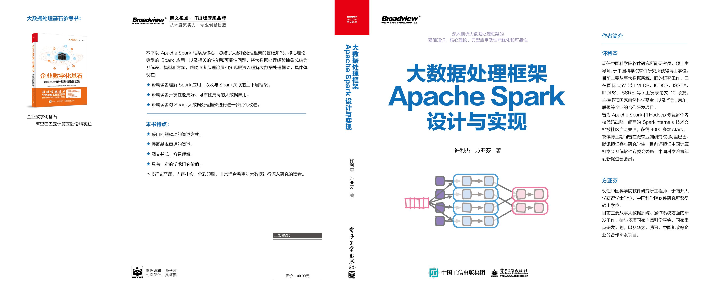
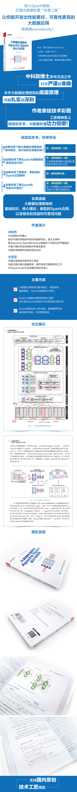

# 说明
本书是许利杰和方亚芬所著的《大数据处理框架Apache Spark设计与实现》书籍配套信息（如前言、代码、图片等）的github存放仓库。

书籍介绍见[前言.pdf](前言.pdf)。

# 书籍勘误与建议

由于作者水平和经验有限，本书的错漏和不足之处欢迎广大读者朋友批评指正，可以将勘误或者意见提交到本项目相关章节的[issues](https://github.com/JerryLead/ApacheSparkBook/issues)中，或者通过电子邮件(csxulijie@gmail.com)联系作者。

# 书籍购买链接

京东：大数据处理框架Apache Spark设计与实现（全彩），https://item.jd.com/12924768.html

# 编辑推荐信息

# 致谢

在本书写作过程中，作者得到了所在单位(中国科学院软件研究所)诸多老师的关注和支持，在此感谢魏峻、武延军、王伟等老师提供的科研工作环境。作者的研究工作受到国家自然科学基金(61802377)，以及中国科学院青年创新促进会的项目支持。 

感谢参与本书初稿讨论和审阅的各位朋友，包括亚马逊的纪树平博士、腾讯的朱锋博士、阿里巴巴的沈雯婷、中国科学院软件研究所的李慧、王栋、叶星彤、康锴等同学，以及 Databricks 的 Xiao Li 博士及其团队。同时，也感谢广大读者对 GitHub 上 SparkInternals 技术文档的支持和反馈意见。

